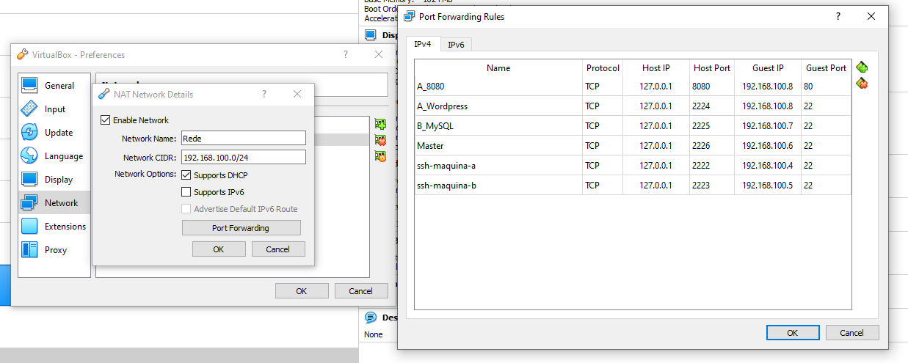
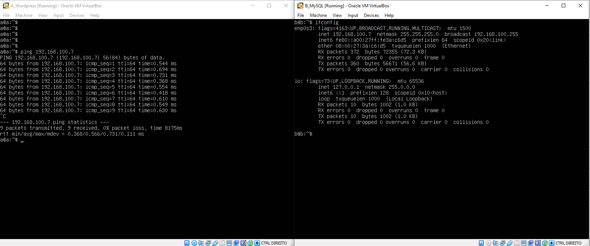
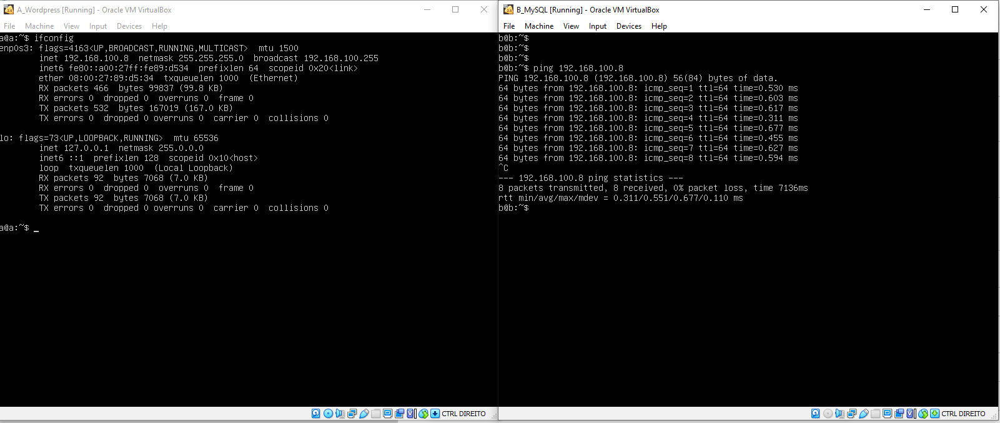
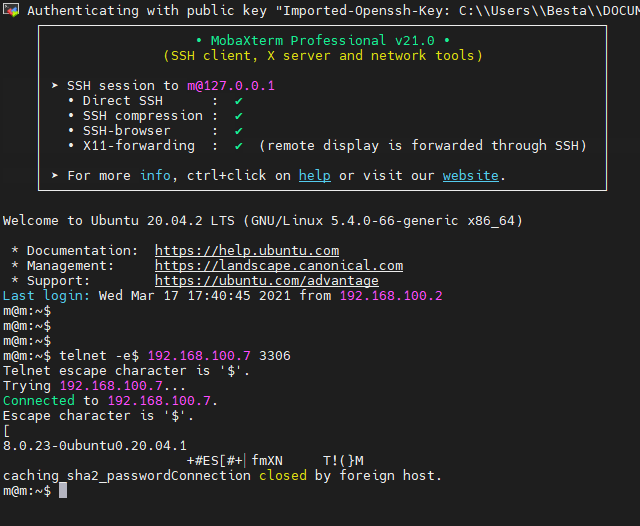
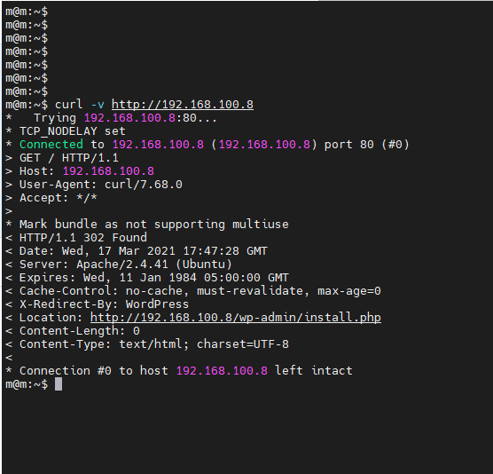
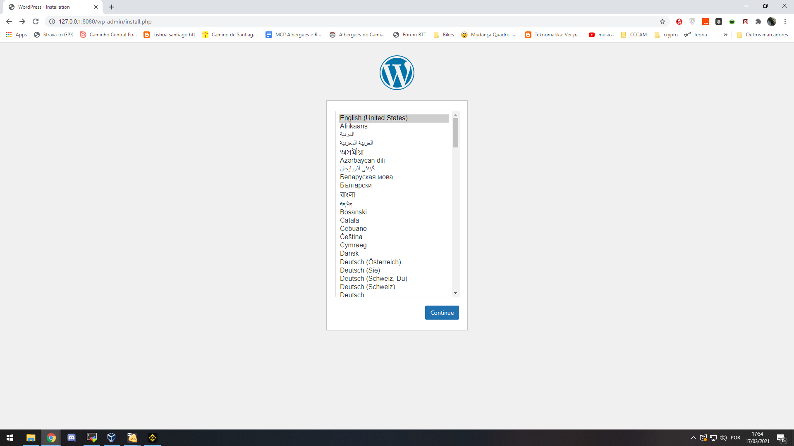

# OutCloud Project

This project is for creating two machines via Ansible for automation and configuration:
 - Machine A with Wordpress 
 - Machine B with MySQL 

### Pre-Requisites

- Having Linux (no GUI) installed on Machine A and Machine B.
    - Having openssh-server net-tools installed on both machines.

- Having ansible openssh-server net-tools git installed on main machine (Machine M)

### How to 

#### Machine A and B:

__Storage__: I have choosed using a ubuntu/bionic64 minimal version (no GUI) for this exercise and confiured the iso file in the Virtual Box storage.


__Networking:__ Fot Machine A and Machine B be able to talk to each other and for security reasons I have choosed NAT network since it acts like our home network with a wireless router. I have created NAT Network "Rede" and set a port fowarding for accessing the VM from another bash console <br>
I have followed [VirtualBox PortForwarding](https://www.virtualbox.org/manual/ch06.html "VirtualBox Port Forwarding") to find out how to do it<br>


__Installing the tools required:__
```
sudo apt update
sudo apt install net-tools openssh-server
```
 - Test connection between both Machines

  
  
  
  


#### Machine M:

__Installing the tools required Machine M:__
```
sudo apt update
sudo apt install ansible net-tools git openssh-server 
```

__Create an ssh key pair for accessing the VM withouth the need for using password__
```
ssh-keygen -t rsa -b 2048 -C "Generating SSH keys for accessing VM"
ssh-copy-id -i <home_dir>/.ssh/id_rsa.pub user@ip_host
```

__Create project directory__
```
mkdir OutCloud
touch playbook.yml
touch inventory
touch vars.yml
```

__Encrypt variables using ansible-vault command:__
```
ansible-vault encrypt vars.yml
```
__Run ansible command:__
```
ansible-playbook playbook.yml -i inventory --user=a --extra-vars "ansible_sudo_pass=" --ask-vault-pass
```

__At the end test the connection to your database and wordpress site:__
 - Installing the tools required:
```
sudo apt update
sudo apt-get install telnet
sudo apt install curl
```
 - Test
```
telnet -e$ <mysql_machine_ip> 3306
```


- Check access to wordpress:
```
curl -v http://<ip_wordpress_machine> 
```


__Confirm Wordpress Running on Machine A__: <br>
To Screenshot Wordpress Interface at Language Selection I needed to portfowarding Machine A to port 8080<br>


<br>

Wordpress Language Selection 



